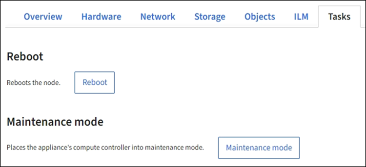

= 
:allow-uri-read: 

.Fasi
. Selezionare *NODI*.
. Selezionare il nodo della griglia che si desidera riavviare.
. Selezionare la scheda *Tasks*.
+

. Selezionare *Reboot* (Riavvia).
+
Viene visualizzata una finestra di dialogo di conferma.

+
image::../media/nodes_tasks_reboot.png[Nodi > attività > pulsante Riavvia]

+

NOTE: Se si sta riavviando il nodo di amministrazione primario, la finestra di dialogo di conferma ricorda che la connessione del browser a Grid Manager viene temporaneamente persa quando i servizi vengono arrestati.

. Inserire la passphrase di provisioning e selezionare *OK*.
. Attendere il riavvio del nodo.
+
L'arresto dei servizi potrebbe richiedere del tempo.

+
Quando il nodo viene riavviato, l'icona grigia (amministrativamente in basso) viene visualizzata sul lato sinistro della pagina *Nodes*. Quando tutti i servizi sono stati riavviati e il nodo è connesso correttamente alla griglia, la pagina *Nodes* dovrebbe visualizzare uno stato normale (nessuna icona a sinistra del nome del nodo), a indicare che nessun avviso è attivo e che il nodo è connesso alla griglia.

