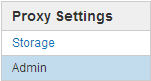

= Configurare le impostazioni del proxy amministratore
:allow-uri-read: 
:icons: font
:imagesdir: ../media/

[role="lead"]
Se si inviano messaggi AutoSupport utilizzando HTTP o HTTPS (vedere link:configure-autosupport-grid-manager.html["Configurare AutoSupport"]), è possibile configurare un server proxy non trasparente tra i nodi di amministrazione e il supporto tecnico (AutoSupport).

.Prima di iniziare
* Si dispone di autorizzazioni di accesso specifiche.
* Hai effettuato l'accesso a Grid Manager utilizzando un link:../admin/web-browser-requirements.html["browser web supportato"].

.A proposito di questa attività
È possibile configurare le impostazioni per un singolo proxy Admin.

.Fasi
. Selezionare *CONFIGURAZIONE* > *sicurezza* > *Impostazioni proxy*.
+
Viene visualizzata la pagina Admin Proxy Settings (Impostazioni proxy amministratore). Per impostazione predefinita, nel menu della barra laterale è selezionata l'opzione *Storage*.

. Dal menu della barra laterale, selezionare *Admin*.
+

. Selezionare la casella di controllo *Enable Admin Proxy* (attiva proxy amministratore).
+
image::../media/proxy_settings_admin.png[Schermata della finestra di dialogo Admin Proxy Settings (Impostazioni proxy amministratore)]

. Immettere il nome host o l'indirizzo IP del server proxy.
. Inserire la porta utilizzata per la connessione al server proxy.
. Se si desidera, inserire il nome utente del proxy.
+
Lasciare vuoto questo campo se il server proxy non richiede un nome utente.

. Se si desidera, inserire la password del proxy.
+
Lasciare vuoto questo campo se il server proxy non richiede una password.

. Selezionare *Salva*.
+
Una volta salvato il proxy Admin, viene configurato il server proxy tra i nodi Admin e il supporto tecnico.

+

NOTE: Le modifiche del proxy possono richiedere fino a 10 minuti.

. Se è necessario disattivare il proxy, deselezionare la casella di controllo *Enable Admin Proxy* (attiva proxy amministratore) e selezionare *Save* (Salva).

