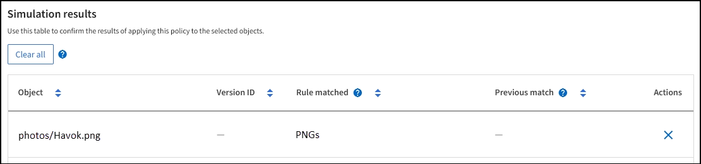

= Simulare un criterio ILM
:allow-uri-read: 
:icons: font
:imagesdir: ../media/

[role="lead"]
Simulare una policy proposta sugli oggetti di test prima di attivare la policy e applicarla ai dati di produzione. La finestra di simulazione offre un ambiente standalone sicuro per le policy di test prima che vengano attivate e applicate ai dati nell'ambiente di produzione.

.Prima di iniziare
* Hai effettuato l'accesso a Grid Manager utilizzando un link:../admin/web-browser-requirements.html["browser web supportato"].
* Hai il link:../admin/admin-group-permissions.html["autorizzazioni di accesso richieste"].
* Conosci il bucket S3/object-key o il container Swift/object-name per ogni oggetto che desideri testare.

.A proposito di questa attività
Selezionare con attenzione gli oggetti che si desidera sottoporre a test il criterio proposto. Per simulare un criterio in maniera approfondita, è necessario testare almeno un oggetto per ciascun filtro in ogni regola.

Ad esempio, se un criterio include una regola per la corrispondenza degli oggetti nel bucket A e un'altra regola per la corrispondenza degli oggetti nel bucket B, è necessario selezionare almeno un oggetto dal bucket A e un oggetto dal bucket B per eseguire un test completo del criterio. Per verificare la regola predefinita, è inoltre necessario selezionare almeno un oggetto da un altro bucket.

Quando si simula un criterio, si applicano le seguenti considerazioni:

* Dopo aver apportato modifiche a un criterio, salvare il criterio proposto. Quindi, simulare il comportamento della policy proposta salvata.
* Quando si simula un criterio, le regole ILM del criterio filtrano gli oggetti di test, in modo da poter vedere quale regola è stata applicata a ciascun oggetto. Tuttavia, non vengono create copie di oggetti e non vengono posizionati oggetti. L'esecuzione di una simulazione non modifica in alcun modo i dati, le regole o i criteri.
* La finestra di simulazione dei criteri proposti conserva gli oggetti testati fino a quando non si seleziona *Cancella tutto* o l'icona Rimuovi image:../media/icon-x-to-remove.png["Icona Remove (Rimuovi)"] Per ogni oggetto nell'elenco risultati di Simulation.
* Simulation restituisce il nome della regola corrispondente. Per determinare quale pool di storage o profilo di erasure coding è in vigore, selezionare il nome della regola per accedere alla pagina dei dettagli della regola, dove è possibile visualizzare il diagramma di conservazione e altri dettagli sulla regola.
* Se la versione S3 è attivata, è possibile inserire l'ID della versione dell'oggetto che si desidera utilizzare per la simulazione.

.Fasi
. link:creating-proposed-ilm-policy.html["Creare una policy proposta"].
. Utilizzando un client S3 o Swift o il link:../tenant/use-s3-console.html["Console S3 sperimentale"], Disponibile in Tenant Manager per ogni tenant, acquisire gli oggetti necessari per testare ogni regola.
. Nella pagina dei criteri ILM, scheda Proposed policy, selezionare *simulate*.
. Nel campo *oggetto*, immettere S3 `bucket/object-key` O il Swift `container/object-name` per un oggetto di test. Ad esempio, `bucket-01/filename.png`.
. Facoltativamente, inserire un ID versione per l'oggetto nel campo *ID versione*.
. Selezionare *simulate*.
. Nella sezione risultati di Simulation, verificare che ogni oggetto sia stato associato alla regola corretta.

== Esempio 1: Verificare le regole quando si simula un criterio ILM proposto

Questo esempio descrive come verificare le regole quando si simula un criterio proposto.

In questo esempio, la *policy ILM di esempio* viene simulata rispetto agli oggetti acquisiti in due bucket. La policy include tre regole, come segue:

* La prima regola, *due copie, due anni per bucket-a*, si applica solo agli oggetti nel bucket-a.
* La seconda regola, *EC objects > 1 MB*, si applica a tutti i bucket, ma ai filtri sugli oggetti superiori a 1 MB.
* La terza regola, *due copie, due data center*, è la regola predefinita. Non include filtri e non utilizza il tempo di riferimento non corrente.

Dopo aver simulato il criterio, verificare che ogni oggetto sia stato associato alla regola corretta.

image::../media/simulate_policy_screen.png[Simulare i risultati delle policy]

In questo esempio:

* `bucket-a/bucket-a object.pdf` corrisponde correttamente alla prima regola, che filtra sugli oggetti in `bucket-a`.
* `bucket-b/test object greater than 1 MB.pdf` è in `bucket-b`, quindi non corrisponde alla prima regola. Al contrario, è stata associata correttamente dalla seconda regola, che filtra su oggetti superiori a 1 MB.
* `bucket-b/test object less than 1 MB.pdf` i filtri non corrispondono alle prime due regole, quindi verranno posizionati in base alla regola predefinita, che non include filtri.

== Esempio 2: Riordinare le regole quando si simula una policy ILM proposta

Questo esempio mostra come è possibile riordinare le regole per modificare i risultati durante la simulazione di un criterio.

In questo esempio, viene simulata la policy *Demo*. Questo criterio, che ha lo scopo di trovare oggetti con metadati utente series=x-men, include tre regole, come segue:

* La prima regola, *PNG*, filtra i nomi delle chiavi che terminano `.png`.
* La seconda regola, *X-MEN*, si applica solo agli oggetti per il tenant A e ai filtri per `series=x-men` metadati dell'utente.
* L'ultima regola, *due copie due data center*, è la regola predefinita, che corrisponde a tutti gli oggetti che non corrispondono alle prime due regole.

.Fasi
. Dopo aver aggiunto le regole e salvato il criterio, selezionare *simulate*.
. Nel campo *oggetto*, immettere il bucket S3/object-key o il container Swift/object-name per un oggetto di test e selezionare *simulate*.
+
Vengono visualizzati i risultati di Simulation, che indicano che il `Havok.png` L'oggetto è stato associato dalla regola *PNG*.

+

+
Tuttavia, `Havok.png` Doveva testare la regola *X-MEN*.

. Per risolvere il problema, riordinare le regole.
+
.. Selezionare *fine* per chiudere la finestra Simula policy ILM.
.. Selezionare *azioni* > *Modifica* per modificare il criterio.
.. Trascinare la regola *X-MEN* all'inizio dell'elenco.
.. Selezionare *Salva*.

. Selezionare *simulate*.
+
Gli oggetti precedentemente testati vengono rivalutati in base alla policy aggiornata e vengono visualizzati i risultati della nuova simulazione. Nell'esempio, la colonna Rule Matched mostra che il `Havok.png` L'oggetto ora corrisponde alla regola dei metadati X-MEN, come previsto. La colonna di confronto precedente mostra che la regola PNG corrisponde all'oggetto nella simulazione precedente.

+
image::../media/simulate_reorder_rules_correct_result.png[Esempio 2: Riordinamento delle regole durante la simulazione di una policy ILM proposta]

+

NOTE: Se si rimane nella scheda Proposed policy (criterio proposto), è possibile simulare nuovamente un criterio dopo aver apportato le modifiche senza dover immettere nuovamente i nomi degli oggetti di test.

== Esempio 3: Correggere una regola durante la simulazione di una policy ILM proposta

Questo esempio mostra come simulare una policy, correggere una regola nella policy e continuare la simulazione.

In questo esempio, viene simulata la policy *Demo*. Questo criterio è destinato a trovare gli oggetti che hanno `series=x-men` metadati dell'utente. Tuttavia, si sono verificati risultati imprevisti durante la simulazione di questa policy rispetto a. `Beast.jpg` oggetto. Invece di corrispondere alla regola dei metadati X-MEN, l'oggetto corrisponde alla regola predefinita, due copie di due data center.

image::../media/simulate_results_for_object_wrong_metadata.png[Esempio 3: Correzione di una regola durante la simulazione di una policy ILM proposta]

Quando un oggetto di test non corrisponde alla regola prevista nel criterio, è necessario esaminare ciascuna regola del criterio e correggere eventuali errori.

.Fasi
. Selezionare *fine* per chiudere la finestra di dialogo Simula policy. Nella scheda Proposed policy (criterio proposto), selezionare *retention diagram* (diagramma di conservazione). Quindi, selezionare *Espandi tutto* o *Visualizza dettagli* per ogni regola in base alle necessità.
. Esaminare l'account tenant della regola, il tempo di riferimento e i criteri di filtraggio.
+
Ad esempio, supponiamo che i metadati per la regola X-MEN fossero stati immessi come "`x-men01`" invece di "`x-Men.`"

. Per risolvere l'errore, correggere la regola come segue:
+
** Se la regola fa parte del criterio proposto, è possibile clonarla o rimuoverla dal criterio e modificarla.
** Se la regola fa parte del criterio attivo, è necessario clonarla. Non è possibile modificare o rimuovere una regola dal criterio attivo.
+
[cols="1a,3a"]
|===
| Opzione | Fasi 

 a| 
Clonare la regola
 a| 
... Selezionare *ILM* > *regole*.
... Selezionare la regola errata e selezionare *Clone*.
... Inserire un nome per la nuova regola, quindi modificare le informazioni errate e selezionare *Crea*.
... Selezionare *ILM* > *Policy* > *Proposed policy*.
... Selezionare *azioni* > *Modifica*.
... Selezionare *Seleziona regole*, quindi selezionare *continua* per accettare la stessa regola predefinita.
... Nel passo Select other rules (Seleziona altre regole), selezionare la casella di controllo per la nuova regola, deselezionare la casella di controllo per la regola originale e selezionare *Select* (Seleziona).
... Se necessario, riordinare le regole trascinando la nuova regola nella posizione corretta.
... Selezionare *Salva*.

 a| 
Modificare la regola
 a| 
... Selezionare *ILM* > *Policy* > *Proposed policy* e rimuovere la regola che si desidera modificare.
... Selezionare *ILM* > *regole*.
... Selezionare la regola che si desidera modificare e selezionare *Modifica*. In alternativa, selezionare la casella di controllo della regola e selezionare *azioni* > *Modifica*.
... Modificare le informazioni non corrette per ciascuna parte della procedura guidata, quindi selezionare *Aggiorna*.
... Selezionare *ILM* > *Policy* > *Proposed policy*.
... Selezionare *azioni* > *Modifica*.
... Selezionare *Seleziona regole*, quindi selezionare *continua* per accettare la stessa regola predefinita.
... Nella finestra di dialogo Seleziona altre regole, selezionare la casella di controllo per la regola corretta, selezionare *Seleziona*, quindi *Salva*.
... Trascinare le righe per le regole non predefinite per determinare l'ordine in cui verranno valutate queste regole.

|===

. Eseguire nuovamente la simulazione.
+
In questo esempio, la regola corretta X-men corrisponde ora a. `Beast.jpg` oggetto basato su `series=x-men` metadati dell'utente, come previsto.

+
image::../media/simulate_results_for_object_corrected_metadata.png[Esempio 3: Correzione di una regola durante la simulazione di una policy ILM proposta]

