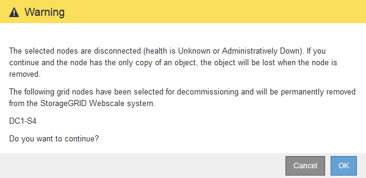

= Decommissionare nodi di rete disconnessi
:allow-uri-read: 
:icons: font
:imagesdir: ../media/

[role="lead"]
Potrebbe essere necessario decommissionare un nodo che non è attualmente connesso alla rete (un nodo il cui stato di salute è sconosciuto o amministrativamente inattivo).

.Prima di iniziare
* Comprendete i requisiti e. link:considerations-for-decommissioning-grid-nodes.html["considerazioni per la disattivazione dei nodi di rete"].
* Sono stati ottenuti tutti gli elementi prerequisiti.
* Hai garantito che non siano attivi lavori di riparazione dei dati. Vedere link:checking-data-repair-jobs.html["Controllare i lavori di riparazione dei dati"].
* Hai confermato che il ripristino del nodo di storage non è in corso in nessun punto della griglia. In tal caso, è necessario attendere il completamento di qualsiasi ricostruzione Cassandra eseguita come parte del ripristino. È quindi possibile procedere con lo smantellamento.
* Si è assicurato che non verranno eseguite altre procedure di manutenzione mentre la procedura di decommissionamento del nodo è in esecuzione, a meno che la procedura di decommissionamento del nodo non sia in pausa.
* La colonna *Dismissione possibile* per il nodo o i nodi disconnessi che si desidera decommissionare include un segno di spunta verde.
* Si dispone della passphrase di provisioning.

.A proposito di questa attività
È possibile identificare i nodi disconnessi cercando le icone sconosciute (blu) o amministrative (grigie) nella colonna *Health*. Nell'esempio, il nodo di storage denominato DC1-S4 è disconnesso; tutti gli altri nodi sono connessi.

image::../media/decommission_nodes_page_one_disconnected.png[Pagina Decommissionate Nodes con un nodo disconnesso]

Prima di disattivare qualsiasi nodo disconnesso, tenere presente quanto segue:

* Questa procedura è principalmente destinata alla rimozione di un singolo nodo disconnesso. Se la griglia contiene più nodi disconnessi, il software richiede di decommissionarli tutti contemporaneamente, aumentando il potenziale di risultati imprevisti.
+

IMPORTANT: Prestare attenzione quando si decommissiona più di un nodo di rete disconnesso alla volta, soprattutto se si selezionano più nodi di storage disconnessi.

* Se non è possibile rimuovere un nodo disconnesso (ad esempio, un nodo di storage necessario per il quorum ADC), non è possibile rimuovere nessun altro nodo disconnesso.

Prima di dismettere un nodo di storage * disconnesso, tenere presente quanto segue

* Non decommissionare mai un nodo di storage disconnesso, a meno che non si sia certi che non possa essere portato online o ripristinato.
+

IMPORTANT: Se si ritiene che i dati dell'oggetto possano essere ancora ripristinati dal nodo, non eseguire questa procedura. Contattare invece il supporto tecnico per determinare se è possibile eseguire il ripristino del nodo.

* Se si decommissiona più di un nodo di storage disconnesso, potrebbe verificarsi una perdita di dati. Il sistema potrebbe non essere in grado di ricostruire i dati se non sono disponibili un numero sufficiente di copie di oggetti, frammenti con codifica di cancellazione o metadati di oggetti.
+

IMPORTANT: Se si dispone di più nodi di storage disconnessi che non è possibile ripristinare, contattare il supporto tecnico per determinare la procedura migliore.

* Quando si decommissiona un nodo di storage disconnesso, StorageGRID avvia i lavori di riparazione dei dati al termine del processo di decommissionamento. Questi processi tentano di ricostruire i dati dell'oggetto e i metadati memorizzati nel nodo disconnesso.
* Quando si decommissiona un nodo di storage disconnesso, la procedura di decommissionamento viene completata in modo relativamente rapido. Tuttavia, i lavori di riparazione dei dati possono richiedere giorni o settimane e non vengono monitorati dalla procedura di decommissionamento. È necessario monitorare manualmente questi lavori e riavviarli secondo necessità. Vedere link:checking-data-repair-jobs.html["Controllare i lavori di riparazione dei dati"].
* Se si decommissiona un nodo di storage disconnesso che contiene l'unica copia di un oggetto, l'oggetto andrà perso. I processi di riparazione dei dati possono ricostruire e ripristinare gli oggetti solo se nei nodi di storage attualmente connessi sono presenti almeno una copia replicata o un numero sufficiente di frammenti con codifica di cancellazione.

Prima di smantellare un nodo *Admin Node* o *Gateway Node* disconnesso, tenere presente quanto segue:

* Quando si decommissiona un nodo di amministrazione disconnesso, i registri di controllo andranno persi da quel nodo; tuttavia, questi registri dovrebbero esistere anche nel nodo di amministrazione primario.
* È possibile decommissionare in modo sicuro un nodo gateway mentre è disconnesso.

.Fasi
. Tentare di riportare in linea eventuali nodi di rete disconnessi o di ripristinarli.
+
Per istruzioni, consultare le procedure di ripristino.

. Se non si riesce a ripristinare un nodo di rete disconnesso e si desidera decommissionarlo mentre è disconnesso, selezionare la casella di controllo corrispondente.
+

NOTE: Se la griglia contiene più nodi disconnessi, il software richiede di decommissionarli tutti contemporaneamente, aumentando il potenziale di risultati imprevisti.

+

IMPORTANT: Prestare attenzione quando si sceglie di decommissionare più di un nodo di rete disconnesso alla volta, soprattutto se si selezionano più nodi di storage disconnessi. Se si dispone di più nodi di storage disconnessi che non è possibile ripristinare, contattare il supporto tecnico per determinare la procedura migliore.

. Inserire la passphrase di provisioning.
+
Il pulsante *Avvia decommissionazione* è attivato.

. Fare clic su *Avvia decommissionazione*.
+
Viene visualizzato un avviso che indica che è stato selezionato un nodo disconnesso e che i dati dell'oggetto andranno persi se il nodo dispone dell'unica copia di un oggetto.

+

. Esaminare l'elenco dei nodi e fare clic su *OK*.
+
Viene avviata la procedura di decommissionamento e l'avanzamento viene visualizzato per ciascun nodo. Durante la procedura, viene generato un nuovo pacchetto di ripristino contenente la modifica della configurazione della griglia.

+
image::../media/decommission_nodes_procedure_in_progress_disconnected.png[schermata dello smantellamento del nodo in corso]

. Non appena il nuovo pacchetto di ripristino sarà disponibile, fare clic sul collegamento o selezionare *MANUTENZIONE* > *sistema* > *pacchetto di ripristino* per accedere alla pagina del pacchetto di ripristino. Quindi, scaricare `.zip` file.
+
Consultare le istruzioni per link:downloading-recovery-package.html["Download del pacchetto di ripristino"].

+

NOTE: Scarica il pacchetto di ripristino il prima possibile per assicurarti di ripristinare la griglia in caso di problemi durante la procedura di decommissionamento.

+

IMPORTANT: Il file del pacchetto di ripristino deve essere protetto perché contiene chiavi di crittografia e password che possono essere utilizzate per ottenere dati dal sistema StorageGRID.

. Monitorare periodicamente la pagina Decommissionare per assicurarsi che tutti i nodi selezionati siano dismessi correttamente.
+
I nodi di storage possono richiedere giorni o settimane per la decommissionazione. Una volta completate tutte le attività, viene visualizzato nuovamente l'elenco di selezione dei nodi con un messaggio di esito positivo. Se si decommissiona un nodo di storage disconnesso, un messaggio di informazioni indica che i lavori di riparazione sono stati avviati.

+
image::../media/decommission_nodes_data_repair.png[schermata che mostra l'inizio dei lavori di riparazione]

. Dopo che i nodi si sono spenti automaticamente nell'ambito della procedura di decommissionamento, rimuovere eventuali macchine virtuali o altre risorse rimanenti associate al nodo decommissionato.
+

IMPORTANT: Non eseguire questo passaggio fino a quando i nodi non si sono spenti automaticamente.

. Se si sta smantellando un nodo di storage, monitorare lo stato dei lavori di riparazione di *dati replicati* e *dati con codifica di cancellazione (EC)* che vengono avviati automaticamente durante il processo di decommissionamento.

[role="tabbed-block"]
====
.Dati replicati
--
* Per ottenere una percentuale di completamento stimata per la riparazione replicata, aggiungere `show-replicated-repair-status` al comando repair-data.
+
`repair-data show-replicated-repair-status`

* Per determinare se le riparazioni sono state completate:
+
.. Selezionare *NODI* > *_nodo di storage in riparazione_* > *ILM*.
.. Esaminare gli attributi nella sezione Valutazione. Al termine delle riparazioni, l'attributo *in attesa - tutto* indica 0 oggetti.

* Per monitorare la riparazione in modo più dettagliato:
+
.. Selezionare *SUPPORT* > *Tools* > *Grid topology*.
.. Selezionare *_Grid_* > *_Storage Node in riparazione_* > *LDR* > *Data Store*.
.. Utilizzare una combinazione dei seguenti attributi per determinare, come possibile, se le riparazioni replicate sono complete.
+

NOTE: Le incongruenze di Cassandra potrebbero essere presenti e le riparazioni non riuscite non vengono monitorate.

+
*** *Tentativi di riparazione (XRPA)*: Utilizzare questo attributo per tenere traccia dell'avanzamento delle riparazioni replicate. Questo attributo aumenta ogni volta che un nodo di storage tenta di riparare un oggetto ad alto rischio. Quando questo attributo non aumenta per un periodo superiore al periodo di scansione corrente (fornito dall'attributo *Scan Period -- Estimated*), significa che la scansione ILM non ha rilevato oggetti ad alto rischio che devono essere riparati su alcun nodo.
+

NOTE: Gli oggetti ad alto rischio sono oggetti che rischiano di essere completamente persi. Non sono inclusi oggetti che non soddisfano la configurazione ILM.

*** *Periodo di scansione -- stimato (XSCM)*: Utilizzare questo attributo per stimare quando verrà applicata una modifica di policy agli oggetti precedentemente acquisiti. Se l'attributo *riparazioni tentate* non aumenta per un periodo superiore al periodo di scansione corrente, è probabile che vengano eseguite riparazioni replicate. Si noti che il periodo di scansione può cambiare. L'attributo *Scan Period -- Estimated (XSCM)* si applica all'intera griglia ed è il massimo di tutti i periodi di scansione del nodo. È possibile eseguire una query nella cronologia degli attributi *Scan Period -- Estimated* per la griglia per determinare un intervallo di tempo appropriato.

--
.Cancellazione dei dati codificati (EC)
--
Per monitorare la riparazione dei dati con codifica erasure e riprovare eventuali richieste che potrebbero non essere riuscite:

. Determinare lo stato delle riparazioni dei dati con codice di cancellazione:
+
** Selezionare *SUPPORTO* > *Strumenti* > *metriche* per visualizzare il tempo stimato per il completamento e la percentuale di completamento per il lavoro corrente. Quindi, selezionare *EC Overview* (Panoramica EC) nella sezione Grafana. Esaminare le dashboard *Grid EC Job Estimated Time to Completion* (tempo stimato per il completamento della commessa EC) e *Grid EC Job Percentage Completed* (percentuale lavoro EC completata).
** Utilizzare questo comando per visualizzare lo stato di uno specifico `repair-data` funzionamento:
+
`repair-data show-ec-repair-status --repair-id repair ID`

** Utilizzare questo comando per elencare tutte le riparazioni:
+
`repair-data show-ec-repair-status`

+
L'output elenca le informazioni, tra cui `repair ID`, per tutte le riparazioni precedentemente e attualmente in esecuzione.

. Se l'output mostra che l'operazione di riparazione non è riuscita, utilizzare `--repair-id` opzione per riprovare la riparazione.
+
Questo comando prova di nuovo una riparazione del nodo non riuscita, utilizzando l'ID riparazione 6949309319275667690:

+
`repair-data start-ec-node-repair --repair-id 6949309319275667690`

+
Questo comando prova di nuovo una riparazione del volume non riuscita, utilizzando l'ID riparazione 6949309319275667690:

+
`repair-data start-ec-volume-repair --repair-id 6949309319275667690`

--
====
.Al termine
Non appena i nodi disconnessi sono stati decommissionati e tutti i lavori di riparazione dei dati sono stati completati, è possibile decommissionare qualsiasi nodo di rete connesso secondo necessità.

Quindi, completare questi passaggi dopo aver completato la procedura di decommissionamento:

* Assicurarsi che i dischi del nodo della griglia decommissionata siano puliti. Utilizzare uno strumento o un servizio di cancellazione dei dati disponibile in commercio per rimuovere in modo permanente e sicuro i dati dai dischi.
* Se un nodo dell'appliance è stato disattivato e i dati dell'appliance sono stati protetti mediante la crittografia del nodo, utilizzare il programma di installazione dell'appliance StorageGRID per cancellare la configurazione del server di gestione delle chiavi (Cancella KMS). Se si desidera aggiungere l'appliance a un'altra griglia, è necessario cancellare la configurazione KMS. Per istruzioni, vedere link:../commonhardware/monitoring-node-encryption-in-maintenance-mode.html["Monitorare la crittografia dei nodi in modalità di manutenzione"].

.Informazioni correlate
link:grid-node-recovery-procedures.html["Procedure di ripristino del nodo Grid"]
