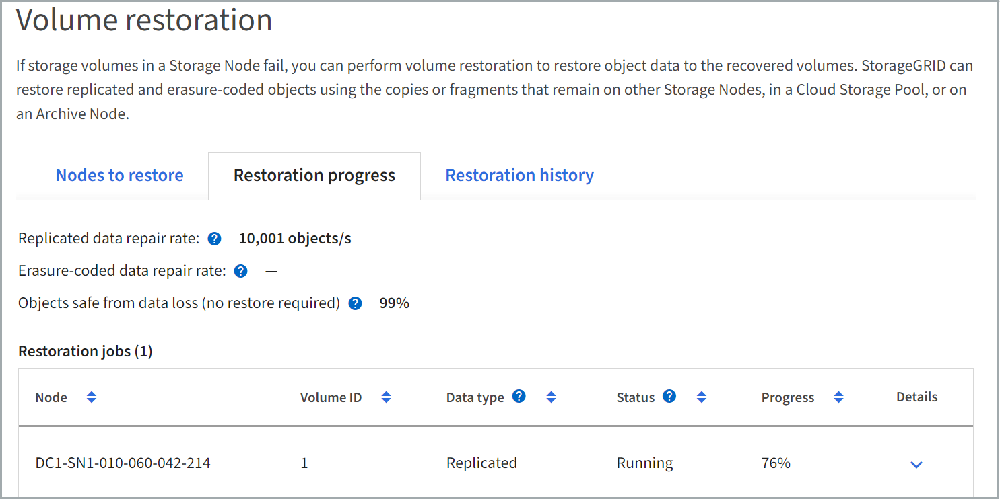

= Ripristinare i dati degli oggetti utilizzando Grid Manager
:allow-uri-read: 
:icons: font
:imagesdir: ../media/

[role="lead"]
È possibile ripristinare i dati degli oggetti per un volume di storage o un nodo di storage guasto utilizzando Grid Manager. È inoltre possibile utilizzare Grid Manager per monitorare i processi di ripristino in corso e visualizzare una cronologia di ripristino.

.Prima di iniziare
* Una di queste procedure è stata completata per formattare i volumi guasti:
+
** link:../maintain/remounting-and-reformatting-appliance-storage-volumes.html["Rimontare e riformattare i volumi di storage delle appliance (procedura manuale)"]
** link:../maintain/remounting-and-reformatting-storage-volumes-manual-steps.html["Rimontare e riformattare i volumi di storage (procedura manuale)"]

* Hai confermato che lo stato di connessione del nodo di storage in cui stai ripristinando gli oggetti è *connesso* image:../media/icon_alert_green_checkmark.png["icona di avviso segno di spunta verde"] Nella scheda *NODI* > *Panoramica* di Grid Manager.
* Hai confermato quanto segue:
+
** Non è in corso un'espansione della griglia per aggiungere un nodo di storage.
** La decommissionazione di un nodo di storage non è in corso o non è riuscita.
** Non è in corso il ripristino di un volume di storage guasto.
** Non è in corso il ripristino di un nodo di storage con un disco di sistema guasto.
** Un lavoro di ribilanciamento EC non è in corso.
** La clonazione del nodo dell'appliance non è in corso.

.A proposito di questa attività
Dopo aver sostituito i dischi ed eseguito le procedure manuali per la formattazione dei volumi, Grid Manager visualizza i volumi come candidati per il ripristino nella scheda *MANUTENZIONE* > *Ripristino volume* > *nodi da ripristinare*.

Se possibile, ripristinare i dati dell'oggetto utilizzando la pagina *Volume Restore* in Grid Manager. Attenersi alle seguenti linee guida:

* Se i volumi sono elencati in *MANUTENZIONE* > *Ripristino volume* > *nodi da ripristinare*, ripristinare i dati degli oggetti come descritto di seguito. I volumi vengono elencati se:
+
** Alcuni, ma non tutti, volumi di storage in un nodo sono guasti
** Tutti i volumi di storage in un nodo sono guasti e vengono sostituiti con lo stesso numero di volumi o più volumi

+
Anche la pagina di ripristino del volume in Grid Manager consente di <<view-restoration-progress,monitorare il processo di ripristino del volume>> e. <<view-restoration-history,visualizzare la cronologia del ripristino>>.

* Se i volumi non sono elencati in Grid Manager come candidati per il ripristino, seguire la procedura appropriata per l'utilizzo di `repair-data` script per ripristinare i dati dell'oggetto:
+
** link:restoring-object-data-to-storage-volume.html["Ripristino dei dati degli oggetti nel volume di storage (errore del disco di sistema)"]
** link:restoring-object-data-to-storage-volume-where-system-drive-is-intact.html["Ripristinare i dati degli oggetti nel volume di storage in cui il disco di sistema è intatto"]
** link:restoring-object-data-to-storage-volume-for-appliance.html["Ripristinare i dati dell'oggetto nel volume di storage per l'appliance"]

+
Se il nodo di storage recuperato contiene un numero inferiore di volumi rispetto al nodo che sta sostituendo, è necessario utilizzare `repair-data` script.

È possibile ripristinare due tipi di dati oggetto:

* Gli oggetti dati replicati vengono ripristinati da altre posizioni, supponendo che le regole ILM della griglia siano state configurate per rendere disponibili le copie degli oggetti.
+
** Se una regola ILM è stata configurata per memorizzare solo una copia replicata e tale copia esisteva su un volume di storage che non ha superato il test, non sarà possibile ripristinare l'oggetto.
** Se l'unica copia rimanente di un oggetto si trova in un pool di storage cloud, StorageGRID deve inviare più richieste all'endpoint del pool di storage cloud per ripristinare i dati dell'oggetto.
** Se l'unica copia rimanente di un oggetto si trova su un nodo di archiviazione, i dati dell'oggetto vengono recuperati dal nodo di archiviazione. Il ripristino dei dati degli oggetti in un nodo di storage da un nodo di archiviazione richiede più tempo rispetto al ripristino delle copie degli oggetti da altri nodi di storage.

* Gli oggetti dati EC (erasure coded) vengono ripristinati riassemblando i frammenti memorizzati. I frammenti corrotti o persi vengono ricreati dall'algoritmo di erasure coding dai dati rimanenti e dai frammenti di parità.

NOTE: Il ripristino dei volumi dipende dalla disponibilità delle risorse in cui sono memorizzate le copie a oggetti. L'avanzamento del ripristino dei volumi non è lineare e potrebbe richiedere giorni o settimane.

== Ripristinare il volume o il nodo guasto

Per ripristinare un volume o un nodo guasto, procedere come segue.

.Fasi
. In Grid Manager, andare a *MANUTENZIONE* > *Volume repristino*.
. Selezionare la scheda *nodi da ripristinare*.
+
Il numero sulla scheda indica il numero di nodi con volumi che richiedono il ripristino.

+
image::../media/vol-restore-nodes-to-restore.png[Ripristino del volume - scheda nodi da ripristinare]

. Espandere ciascun nodo per visualizzare i volumi in esso che richiedono il ripristino e il relativo stato.
. Correggere eventuali problemi che impediscono il ripristino di ciascun volume indicati quando si seleziona Waiting for manual steps (in attesa di operazioni manuali), se visualizzato come stato del volume.
. Selezionare un nodo da ripristinare in cui tutti i volumi indicano uno stato Pronto per il ripristino.
+
È possibile ripristinare i volumi solo per un nodo alla volta.

+
Ogni volume nel nodo deve indicare che è pronto per il ripristino.

. Selezionare *Avvia ripristino*.
. Risolvere eventuali avvisi che potrebbero essere visualizzati o selezionare *Avvia comunque* per ignorare gli avvisi e avviare il ripristino.

I nodi vengono spostati dalla scheda *Nodes to restore* (nodi da ripristinare) alla scheda *Restoration Progress* (avanzamento ripristino) all'avvio del ripristino.

Se non è possibile avviare il ripristino di un volume, il nodo torna alla scheda *nodi da ripristinare*.

== [[view-ripristino-progresso]]Visualizza l'avanzamento del ripristino

La scheda *Restoration Progress* (avanzamento ripristino) mostra lo stato del processo di ripristino del volume e le informazioni sui volumi di un nodo da ripristinare.

I tassi di riparazione dei dati per gli oggetti replicati e con codifica di cancellazione in tutti i volumi sono stime che riassumono tutti i ripristini in corso, inclusi i ripristini iniziati con `repair-data` script. Viene indicata anche la percentuale di oggetti in quei volumi che sono intatti e non richiedono il ripristino.

NOTE: Il ripristino dei dati replicati dipende dalla disponibilità delle risorse in cui sono memorizzate le copie replicate. L'avanzamento del ripristino dei dati replicati non è lineare e potrebbe richiedere giorni o settimane.

La sezione lavori di ripristino visualizza informazioni sui ripristini dei volumi avviati da Grid Manager.

* Il numero nell'intestazione della sezione lavori di ripristino indica il numero di volumi che vengono ripristinati o messi in coda per il ripristino.
* La tabella visualizza le informazioni relative a ciascun volume di un nodo da ripristinare e al relativo stato di avanzamento.
+
** L'avanzamento per ciascun nodo visualizza la percentuale per ciascun lavoro.
** Espandere la colonna Dettagli per visualizzare l'ora di inizio del ripristino e l'ID del processo.

* Se il ripristino di un volume non riesce:
+
** La colonna Status (Stato) indica failed (non riuscito)
** Viene visualizzato un errore che indica la causa del guasto.
+
Correggere i problemi indicati nell'errore. Quindi selezionare *Riprova* per riavviare il ripristino del volume.

+
Se più processi di ripristino non sono riusciti, selezionando *Riprova* viene avviato l'ultimo processo non riuscito.

== [[view-restaurazione-storia]]Visualizza la cronologia del ripristino

La scheda *Restoration history* (Cronologia ripristino) mostra informazioni su tutti i ripristini dei volumi completati correttamente.

NOTE: Le dimensioni non sono applicabili agli oggetti replicati e vengono visualizzate solo per i ripristini che contengono oggetti dati EC (erasure coded).

image::../media/vol-restore-restore-history.png[Ripristino del volume - scheda Restoration history (Cronologia ripristino)]
