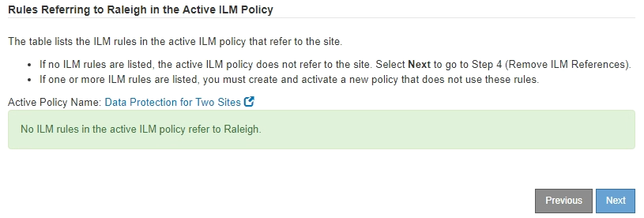

= Fase 3: Revisione della policy ILM
:allow-uri-read: 
:icons: font
:imagesdir: ../media/

[role="lead"]
Dalla fase 3 (revisione policy ILM) della procedura guidata Decommission Site (Sito di rimozione), è possibile determinare se il sito fa riferimento al criterio ILM attivo.

.Prima di iniziare
Hai una buona conoscenza del funzionamento di ILM e conosci la creazione di pool di storage, l'eliminazione dei profili di codifica, le regole ILM e la simulazione e l'attivazione di un criterio ILM. Vedere link:../ilm/index.html["Gestire gli oggetti con ILM"].

.A proposito di questa attività
StorageGRID non può decommissionare un sito se tale sito è indicato da una regola ILM nel criterio ILM attivo.

Se la policy ILM corrente fa riferimento al sito che si desidera rimuovere, è necessario attivare una nuova policy ILM che soddisfi determinati requisiti. In particolare, la nuova policy ILM:

* Non è possibile utilizzare un pool di storage che si riferisce al sito o l'opzione All Sites (tutti i siti).
* Impossibile utilizzare un profilo di erasure coding che si riferisce al sito.
* Impossibile utilizzare la regola Make 2 Copies di StorageGRID 11.6 o installazioni precedenti.
* Deve essere progettato per proteggere completamente tutti i dati degli oggetti.
+

IMPORTANT: Non creare mai una regola ILM a copia singola per consentire la rimozione di un sito. Una regola ILM che crea una sola copia replicata per qualsiasi periodo di tempo mette i dati a rischio di perdita permanente. Se esiste una sola copia replicata di un oggetto, quest'ultimo viene perso in caso di errore o errore significativo di un nodo di storage. Inoltre, durante le procedure di manutenzione, ad esempio gli aggiornamenti, si perde temporaneamente l'accesso all'oggetto.

Se si esegue una _decommissionazione del sito connesso_, è necessario considerare come StorageGRID deve gestire i dati dell'oggetto attualmente nel sito che si desidera rimuovere. A seconda dei requisiti di protezione dei dati, le nuove regole possono spostare i dati degli oggetti esistenti in siti diversi o eliminare eventuali copie di oggetti extra non più necessarie.

Contattare il supporto tecnico per ricevere assistenza nella progettazione della nuova policy.

.Fasi
. Dalla fase 3 (revisione policy ILM), determinare se eventuali regole ILM nel criterio ILM attivo fanno riferimento al sito selezionato per la rimozione.
. Se non sono elencate regole, selezionare *Avanti* per passare a. link:step-4-remove-ilm-references.html["Fase 4: Rimuovere i riferimenti ILM"].
. Se una o più regole ILM sono elencate nella tabella, selezionare il collegamento accanto a *Active Policy Name*.
+
La pagina dei criteri ILM viene visualizzata in una nuova scheda del browser. Utilizzare questa scheda per aggiornare ILM. La pagina Decommission Site rimane aperta nella scheda Other (Altro).

+
.. Se necessario, selezionare *ILM* > *Storage Pools* per creare uno o più pool di storage che non fanno riferimento al sito.
+

NOTE: Per ulteriori informazioni, consulta le istruzioni per la gestione degli oggetti con la gestione del ciclo di vita delle informazioni.

.. Se si intende utilizzare la codifica di cancellazione, selezionare *ILM* > *Erasure coding* per creare uno o più profili di codifica di cancellazione.
+
È necessario selezionare i pool di storage che non fanno riferimento al sito.

+

NOTE: Non utilizzare il pool di storage *tutti i nodi di storage* (StorageGRID 11.6 e versioni precedenti) nei profili di erasure coding.

. Selezionare *ILM* > *Rules* e clonare ciascuna delle regole elencate nella tabella per la fase 3 (rivedere la policy ILM).
+

NOTE: Per ulteriori informazioni, consulta le istruzioni per la gestione degli oggetti con la gestione del ciclo di vita delle informazioni.

+
.. Utilizzare nomi che semplificino la selezione di queste regole in una nuova policy.
.. Aggiornare le istruzioni di posizionamento.
+
Rimuovere eventuali pool di storage o cancellare i profili di codifica che fanno riferimento al sito e sostituirli con nuovi pool di storage o cancellare i profili di codifica.

+

NOTE: Non utilizzare il pool di storage *All Storage Node* nelle nuove regole.

. Selezionare *ILM* > *Policies* e creare una nuova policy che utilizzi le nuove regole.
+

NOTE: Per ulteriori informazioni, consulta le istruzioni per la gestione degli oggetti con la gestione del ciclo di vita delle informazioni.

+
.. Selezionare il criterio attivo e selezionare *Clone*.
.. Specificare il nome di un criterio e il motivo della modifica.
.. Selezionare le regole per il criterio clonato.
+
*** Cancellare tutte le regole elencate per la fase 3 (revisione policy ILM) della pagina Sito di smantellamento.
*** Selezionare una regola predefinita che non si riferisce al sito.
+

NOTE: Non selezionare la regola *Crea 2 copie* perché questa regola utilizza il pool di storage *tutti i nodi di storage*, che non è consentito.

*** Selezionare le altre regole di sostituzione create. Queste regole non devono fare riferimento al sito.
+
image::../media/decommission_site_step_3_cloned_policy.png[Decommissionare la policy clonata fase 3 del sito]

.. Selezionare *Applica*.
.. Trascinare le righe per riordinare le regole nel criterio.
+
Impossibile spostare la regola predefinita.

+

IMPORTANT: Verificare che le regole ILM siano nell'ordine corretto. Una volta attivato il criterio, gli oggetti nuovi ed esistenti vengono valutati dalle regole nell'ordine elencato, iniziando dall'inizio.

.. Salvare la policy proposta.

. Acquisire oggetti di test e simulare il criterio proposto per garantire l'applicazione delle regole corrette.
+

CAUTION: Gli errori in un criterio ILM possono causare una perdita di dati irrecuperabile. Esaminare attentamente e simulare la policy prima di attivarla per confermare che funzionerà come previsto.

+

CAUTION: Quando si attiva un nuovo criterio ILM, StorageGRID lo utilizza per gestire tutti gli oggetti, inclusi quelli esistenti e quelli acquisiti di recente. Prima di attivare un nuovo criterio ILM, esaminare le eventuali modifiche apportate al posizionamento degli oggetti replicati e codificati in cancellazione esistenti. La modifica della posizione di un oggetto esistente potrebbe causare problemi di risorse temporanee quando i nuovi posizionamenti vengono valutati e implementati.

. Attivare la nuova policy.
+
Se si sta eseguendo una decommissionazione del sito connesso, StorageGRID inizia a rimuovere i dati dell'oggetto dal sito selezionato non appena si attiva il nuovo criterio ILM. Lo spostamento o l'eliminazione di tutte le copie degli oggetti potrebbe richiedere settimane. Sebbene sia possibile avviare in sicurezza la decommissionazione di un sito mentre i dati degli oggetti sono ancora presenti nel sito, la procedura di decommissionazione viene completata più rapidamente e con meno interruzioni e impatti sulle performance se si consente di spostare i dati dal sito prima di avviare la procedura di decommissionazione effettiva (Selezionando *Avvia decommissionazione* nella fase 5 della procedura guidata).

. Tornare al passaggio 3 (revisione policy ILM)* per assicurarsi che nessuna regola ILM nel nuovo criterio attivo faccia riferimento al sito e che il pulsante *Avanti* sia attivato.
+

+

NOTE: Se sono elencate delle regole, è necessario creare e attivare una nuova policy ILM prima di poter continuare.

. Se non sono elencate regole, selezionare *Avanti*.
+
Viene visualizzato il punto 4 (Rimuovi riferimenti ILM).

