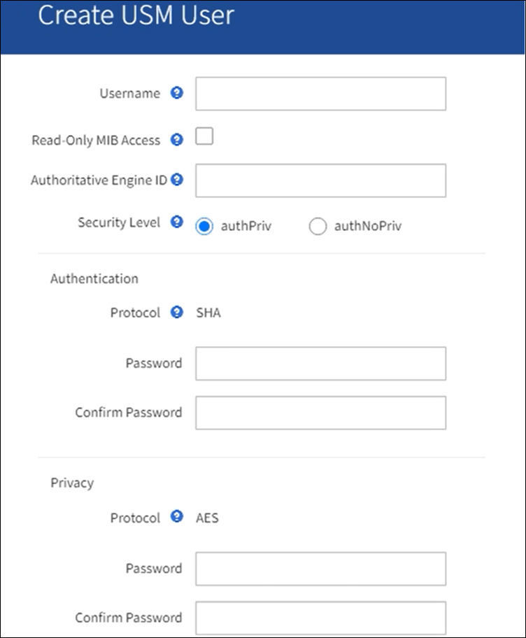

= Configurare l'agente SNMP
:allow-uri-read: 
:icons: font
:imagesdir: ../media/

[role="lead"]
È possibile configurare l'agente SNMP StorageGRID se si desidera utilizzare un sistema di gestione SNMP di terze parti per l'accesso MIB di sola lettura e le notifiche.

.Prima di iniziare
* Hai effettuato l'accesso a Grid Manager utilizzando un link:../admin/web-browser-requirements.html["browser web supportato"].
* Si dispone dell'autorizzazione di accesso root.

.A proposito di questa attività
L'agente SNMP StorageGRID supporta tutte e tre le versioni del protocollo SNMP. È possibile configurare l'agente per una o più versioni.

.Fasi
. Selezionare *CONFIGURATION* > *Monitoring* > *SNMP Agent*.
+
Viene visualizzata la pagina SNMP Agent.

+
image::../media/snmp_agent_not_enabled.png[Agente SNMP non abilitato]

. Per attivare l'agente SNMP su tutti i nodi della griglia, selezionare la casella di controllo *Enable SNMP* (attiva SNMP).
+
Vengono visualizzati i campi per la configurazione di un agente SNMP.

+
image::../media/snmp_agent_page.png[Pagina SNMP Agent]

. Nel campo *contatto di sistema*, immettere il valore che StorageGRID deve fornire nei messaggi SNMP per sysContact.
+
Il contatto di sistema in genere è un indirizzo e-mail. Il valore fornito si applica a tutti i nodi nel sistema StorageGRID. *Il campo System Contact* può contenere al massimo 255 caratteri.

. Nel campo *posizione sistema*, immettere il valore che si desidera che StorageGRID fornisca nei messaggi SNMP per sysLocation.
+
La posizione del sistema può essere qualsiasi informazione utile per identificare la posizione del sistema StorageGRID. Ad esempio, è possibile utilizzare l'indirizzo di una struttura. Il valore fornito si applica a tutti i nodi nel sistema StorageGRID. *System Location* può contenere un massimo di 255 caratteri.

. Mantenere selezionata la casella di controllo *attiva notifiche agente SNMP* se si desidera che l'agente SNMP StorageGRID invii messaggi trap e avvisi.
+
Se questa casella di controllo è deselezionata, l'agente SNMP supporta l'accesso MIB di sola lettura, ma non invia alcuna notifica SNMP.

. Selezionare la casella di controllo *attiva trap di autenticazione* se si desidera che l'agente SNMP di StorageGRID invii una trap di autenticazione se riceve un messaggio di protocollo autenticato in modo errato.
. Se si utilizza SNMPv1 o SNMPv2c, completare la sezione Community Strings.
+
I campi di questa sezione vengono utilizzati per l'autenticazione basata sulla community in SNMPv1 o SNMPv2c. Questi campi non si applicano a SNMPv3.

+
.. Nel campo *Default Trap Community* (Comunità trap predefinita), immettere facoltativamente la stringa di comunità predefinita che si desidera utilizzare per le destinazioni trap.
+
Se necessario, è possibile fornire una stringa di community diversa ("`custom`") <<select_trap_destination,definire una destinazione trap specifica>>.

+
*Default Trap Community* può contenere un massimo di 32 caratteri e non può contenere spazi vuoti.

.. Per *Read-only Community*, immettere una o più stringhe di comunità per consentire l'accesso MIB di sola lettura sugli indirizzi degli agenti IPv4 e IPv6. Selezionare il segno più image:../media/icon_plus_sign_black_on_white_old.png["Segno più"] per aggiungere più stringhe.
+
Quando il sistema di gestione interroga il MIB StorageGRID, invia una stringa di comunità. Se la stringa di comunità corrisponde a uno dei valori specificati, l'agente SNMP invia una risposta al sistema di gestione.

+
Ogni stringa di community può contenere un massimo di 32 caratteri e non può contenere spazi vuoti. Sono consentite fino a cinque stringhe.

+

NOTE: Per garantire la sicurezza del sistema StorageGRID, non utilizzare "`public`" come stringa di community. Se non si immette una stringa di comunità, l'agente SNMP utilizza l'ID griglia del sistema StorageGRID come stringa di comunità.

. Facoltativamente, selezionare la scheda indirizzi agente nella sezione altre configurazioni.
+
Utilizzare questa scheda per specificare uno o più "`indirizzi in attesa`". Questi sono gli indirizzi StorageGRID sui quali l'agente SNMP può ricevere le query. Ogni indirizzo dell'agente include un protocollo Internet, un protocollo di trasporto, una rete StorageGRID e, facoltativamente, una porta.

+
Se non si configura un indirizzo dell'agente, l'indirizzo di ascolto predefinito è la porta UDP 161 su tutte le reti StorageGRID.

+
.. Selezionare *Crea*.
+
Viene visualizzata la finestra di dialogo Create Agent Address (Crea indirizzo agente).

+
image::../media/snmp_create_agent_address.png[SNMP Agent Address (Indirizzo agente SNMP)]

.. Per *Internet Protocol*, selezionare se questo indirizzo utilizzerà IPv4 o IPv6.
+
Per impostazione predefinita, SNMP utilizza IPv4.

.. Per *Transport Protocol*, selezionare se questo indirizzo utilizzerà UDP o TCP.
+
Per impostazione predefinita, SNMP utilizza UDP.

.. Nel campo *rete StorageGRID*, selezionare la rete StorageGRID su cui si desidera ricevere la query.
+
*** Reti griglia, amministratore e client: StorageGRID deve rimanere in attesa delle query SNMP su tutte e tre le reti.
*** Grid Network
*** Admin Network (rete amministrativa)
*** Rete client
+

NOTE: Per garantire che le comunicazioni client con StorageGRID rimangano sicure, non creare un indirizzo agente per la rete client.

.. Nel campo *Port* (porta), immettere il numero di porta su cui l'agente SNMP deve rimanere in attesa.
+
La porta UDP predefinita per un agente SNMP è 161, ma è possibile immettere qualsiasi numero di porta inutilizzato.

+

NOTE: Quando si salva l'agente SNMP, StorageGRID apre automaticamente le porte degli indirizzi dell'agente sul firewall interno. È necessario assicurarsi che tutti i firewall esterni consentano l'accesso a queste porte.

.. Selezionare *Crea*.
+
L'indirizzo dell'agente viene creato e aggiunto alla tabella.

+
image::../media/snmp_other_configurations_agent_addresses_table.png[Tabella SNMP Other Configurations Agent Addresses]

. Se si utilizza SNMPv3, selezionare la scheda utenti USM nella sezione altre configurazioni.
+
Utilizzare questa scheda per definire gli utenti USM autorizzati a interrogare il MIB o a ricevere trap e informazioni.

+

NOTE: Questo passaggio non è valido se si utilizza solo SNMPv1 o SNMPv2c.

+
.. Selezionare *Crea*.
+
Viene visualizzata la finestra di dialogo Create USM User (Crea utente USM).

+

.. Immettere un *Username* univoco per questo utente USM.
+
I nomi utente hanno un massimo di 32 caratteri e non possono contenere spazi vuoti. Il nome utente non può essere modificato dopo la creazione dell'utente.

.. Selezionare la casella di controllo *Read-only MIB Access* (accesso MIB di sola lettura) se l'utente deve disporre dell'accesso di sola lettura al MIB.
+
Se si seleziona *Read-only MIB Access* (accesso MIB di sola lettura), il campo *Authoritative Engine ID* (ID motore autorevole) viene disattivato.

+

NOTE: Gli utenti USM con accesso MIB di sola lettura non possono avere ID motore.

.. Se questo utente verrà utilizzato in una destinazione di tipo inform, immettere il *Authoritative Engine ID* per questo utente.
+

NOTE: Le destinazioni SNMPv3 inform devono avere utenti con ID motore. La destinazione della trap SNMPv3 non può avere utenti con ID motore.

+
L'ID del motore autorevole può essere compreso tra 5 e 32 byte in formato esadecimale.

.. Selezionare un livello di sicurezza per l'utente USM.
+
*** *Authprim*: Questo utente comunica con autenticazione e privacy (crittografia). È necessario specificare un protocollo di autenticazione e una password, nonché un protocollo e una password per la privacy.
*** *AuthNoPriv*: Questo utente comunica con autenticazione e senza privacy (senza crittografia). Specificare un protocollo di autenticazione e una password.

.. Inserire e confermare la password che verrà utilizzata dall'utente per l'autenticazione.
+

NOTE: L'unico protocollo di autenticazione supportato è SHA (HMAC-SHA-96).

.. Se si seleziona *authprim*, immettere e confermare la password che verrà utilizzata dall'utente per la privacy.
+

NOTE: L'unico protocollo per la privacy supportato è AES.

.. Selezionare *Crea*.
+
L'utente USM viene creato e aggiunto alla tabella.

+
image::../media/snmp_other_config_usm_users_table.png[Tabella utente SNMP Other Config USM]

. [[Select_trap_destination, start=10]]nella sezione Other Configurations (altre configurazioni), selezionare la scheda Trap Destinations (Destinazioni trap).
+
La scheda Destinazioni trap consente di definire una o più destinazioni per le trap StorageGRID o le notifiche di notifica. Quando si attiva l'agente SNMP e si seleziona *Salva*, StorageGRID inizia a inviare notifiche a ciascuna destinazione definita. Le notifiche vengono inviate quando vengono attivati gli avvisi. Vengono inoltre inviate notifiche standard per le entità MIB-II supportate (ad esempio ifdown e coldstart).

+
.. Selezionare *Crea*.
+
Viene visualizzata la finestra di dialogo Create Trap Destination (Crea destinazione trap).

+
image::../media/snmp_create_trap_destination.png[SNMP Create Trap Destination (Crea destinazione trap SNMP]

.. Nel campo *Version*, selezionare la versione SNMP da utilizzare per questa notifica.
.. Completare il modulo in base alla versione selezionata
+
[cols="1a,2a"]
|===
| Versione | Specificare queste informazioni 

 a| 
SNMPv1

(Per SNMPv1, l'agente SNMP può inviare solo trap. Le informazioni non sono supportate).
 a| 
... Nel campo *host*, immettere un indirizzo IPv4 o IPv6 (o FQDN) per ricevere la trap.
... Per *Port*, utilizzare il valore predefinito (162), a meno che non sia necessario utilizzare un altro valore. (162 è la porta standard per i trap SNMP).
... Per *Protocol* (protocollo), utilizzare il valore predefinito (UDP). È supportato anche il protocollo TCP. (UDP è il protocollo SNMP trap standard).
... Utilizzare la community trap predefinita, se specificata nella pagina SNMP Agent, oppure immettere una stringa di community personalizzata per questa destinazione trap.
+
La stringa di community personalizzata può contenere un massimo di 32 caratteri e non può contenere spazi vuoti.

 a| 
SNMPv2c
 a| 
... Selezionare se la destinazione deve essere utilizzata per trap o informazioni.
... Nel campo *host*, immettere un indirizzo IPv4 o IPv6 (o FQDN) per ricevere la trap.
... Per *Port*, utilizzare il valore predefinito (162), a meno che non sia necessario utilizzare un altro valore. (162 è la porta standard per i trap SNMP).
... Per *Protocol* (protocollo), utilizzare il valore predefinito (UDP). È supportato anche il protocollo TCP. (UDP è il protocollo SNMP trap standard).
... Utilizzare la community trap predefinita, se specificata nella pagina SNMP Agent, oppure immettere una stringa di community personalizzata per questa destinazione trap.
+
La stringa di community personalizzata può contenere un massimo di 32 caratteri e non può contenere spazi vuoti.

 a| 
SNMPv3
 a| 
... Selezionare se la destinazione deve essere utilizzata per trap o informazioni.
... Nel campo *host*, immettere un indirizzo IPv4 o IPv6 (o FQDN) per ricevere la trap.
... Per *Port*, utilizzare il valore predefinito (162), a meno che non sia necessario utilizzare un altro valore. (162 è la porta standard per i trap SNMP).
... Per *Protocol* (protocollo), utilizzare il valore predefinito (UDP). È supportato anche il protocollo TCP. (UDP è il protocollo SNMP trap standard).
... Selezionare l'utente USM che verrà utilizzato per l'autenticazione.
+
**** Se si seleziona *Trap*, vengono visualizzati solo gli utenti USM senza ID motore autorevoli.
**** Se si seleziona *inform*, vengono visualizzati solo gli utenti USM con ID motore autorevoli.

|===
.. Selezionare *Crea*.
+
La destinazione trap viene creata e aggiunta alla tabella.

. Una volta completata la configurazione dell'agente SNMP, selezionare *Salva*.
+
La nuova configurazione dell'agente SNMP diventa attiva.

.Informazioni correlate
link:silencing-alert-notifications.html["Tacitare le notifiche di avviso"]
