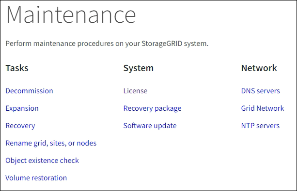
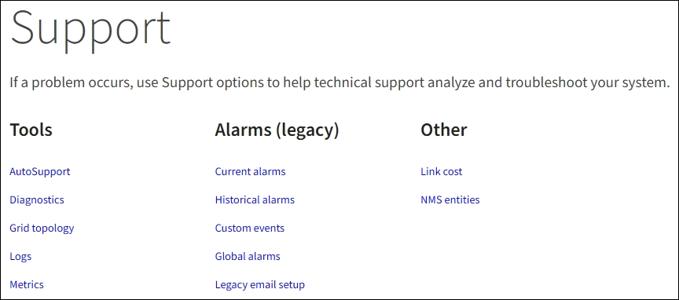

= Esplora Grid Manager
:allow-uri-read: 
:icons: font
:imagesdir: ../media/

[role="lead"]
Grid Manager è l'interfaccia grafica basata su browser che consente di configurare, gestire e monitorare il sistema StorageGRID.

Quando si accede a Grid Manager, si sta effettuando la connessione a un nodo amministratore. Ogni sistema StorageGRID include un nodo di amministrazione primario e un numero qualsiasi di nodi di amministrazione non primari. È possibile connettersi a qualsiasi nodo amministratore e ciascun nodo amministratore visualizza una vista simile del sistema StorageGRID.

È possibile accedere a Grid Manager utilizzando un link:../admin/web-browser-requirements.html["browser web supportato"].

== Dashboard di Grid Manager

Quando accedi per la prima volta a Grid Manager, puoi utilizzare la dashboard per monitorare le attività del sistema a colpo d'occhio.

La dashboard contiene informazioni sullo stato e le performance del sistema, sull'utilizzo dello storage, sui processi ILM, sulle operazioni S3 e Swift e sui nodi della griglia. È possibile configurare la dashboard selezionando da una raccolta di schede che contengono le informazioni necessarie per monitorare efficacemente il sistema.

image::../media/grid_manager_dashboard.png[Dashboard in Grid Manager]

Per una spiegazione delle informazioni visualizzate su ciascuna scheda, selezionare l'icona della guida image:../media/icon_nms_question.png["icona del punto interrogativo"] per quella scheda.

.Scopri di più
* link:../monitor/viewing-dashboard.html["Visualizzare e configurare la dashboard"]

== Campo di ricerca

Il campo *Search* nella barra di intestazione consente di accedere rapidamente a una pagina specifica all'interno di Grid Manager. Ad esempio, è possibile immettere *km* per accedere alla pagina del server di gestione delle chiavi (KMS). È possibile utilizzare *Cerca* per trovare le voci nella barra laterale di Grid Manager e nei menu Configurazione, manutenzione e supporto.

== Menu Guida

Il menu della guida image:../media/icon-help-menu-bar.png["icona della guida sulla barra dei menu"] Consente di accedere all'installazione guidata di FabricPool e S3, al centro di documentazione di StorageGRID per la release corrente e alla documentazione API. È inoltre possibile determinare quale versione di StorageGRID è attualmente installata.

image::../media/help_menu.png[Menu Guida]

.Scopri di più
* link:../fabricpool/use-fabricpool-setup-wizard.html["Utilizzare l'installazione guidata di FabricPool"]
* link:../admin/use-s3-setup-wizard.html["Utilizzare l'installazione guidata S3"]
* link:../admin/using-grid-management-api.html["Utilizzare l'API Grid Management"]

== Menu Avvisi

Il menu Avvisi fornisce un'interfaccia di facile utilizzo per rilevare, valutare e risolvere i problemi che potrebbero verificarsi durante il funzionamento di StorageGRID.

image::../media/alerts_menu.png[Menu Avvisi]

Dal menu Alerts (Avvisi), è possibile effettuare le seguenti operazioni:

* Rivedere gli avvisi correnti
* Esaminare gli avvisi risolti
* Configurare i silenzi per eliminare le notifiche di avviso
* Definire le regole di avviso per le condizioni che attivano gli avvisi
* Configurare il server di posta elettronica per le notifiche degli avvisi

.Scopri di più
* link:../monitor/managing-alerts.html["Gestire gli avvisi"]

== Pagina nodi

La pagina Nodes (nodi) visualizza informazioni sull'intera griglia, su ciascun sito della griglia e su ciascun nodo di un sito.

La home page dei nodi visualizza le metriche combinate per l'intera griglia. Per visualizzare le informazioni relative a un determinato sito o nodo, selezionare il sito o nodo.

image::../media/nodes_menu.png[pagina principale nodi]

.Scopri di più
* link:../monitor/viewing-nodes-page.html["Visualizzare la pagina nodi"]

== Pagina tenant

La pagina tenant consente di creare e monitorare gli account tenant di storage per il sistema StorageGRID. È necessario creare almeno un account tenant per specificare chi può memorizzare e recuperare gli oggetti e quali funzionalità sono disponibili.

La pagina tenant fornisce inoltre dettagli sull'utilizzo di ciascun tenant, tra cui la quantità di storage utilizzato e il numero di oggetti. Se si imposta una quota al momento della creazione del tenant, è possibile visualizzare la quantità di tale quota utilizzata.

image::../media/tenants_menu_and_page.png[Menu e pagina dei tenant]

.Scopri di più
* link:../admin/managing-tenants.html["Gestire i tenant"]
* link:../tenant/index.html["Utilizzare un account tenant"]

== Menu ILM

Il menu ILM consente di configurare le regole e le policy ILM (Information Lifecycle Management) che regolano la durata e la disponibilità dei dati. È inoltre possibile inserire un identificatore di oggetto per visualizzare i metadati relativi a tale oggetto.

image::../media/ilm_menu_and_page.png[Menu e pagina ILM]

.Scopri di più
* link:using-information-lifecycle-management.html["Utilizza la gestione del ciclo di vita delle informazioni"]
* link:../ilm/index.html["Gestire gli oggetti con ILM"]

== Menu di configurazione

Il menu Configurazione consente di specificare le impostazioni di rete, di sicurezza, di sistema, di monitoraggio e di controllo degli accessi.

image::../media/configuration_menu.png[Menu Configuration (Configurazione)]

=== Attività di rete

Le attività di rete includono:

* link:../admin/managing-high-availability-groups.html["Gestione di gruppi ad alta disponibilità"]
* link:../admin/managing-load-balancing.html["Gestione degli endpoint del bilanciamento del carico"]
* link:../admin/configuring-s3-api-endpoint-domain-names.html["Configurazione dei nomi di dominio degli endpoint S3"]
* link:../admin/managing-traffic-classification-policies.html["Gestione delle policy di classificazione del traffico"]
* link:../admin/configure-vlan-interfaces.html["Configurazione delle interfacce VLAN"]

=== Attività di sicurezza

Le attività di sicurezza includono:

* link:../admin/using-storagegrid-security-certificates.html["Gestione dei certificati di sicurezza"]
* link:../admin/manage-firewall-controls.html["Gestione dei controlli firewall interni"]
* link:../admin/kms-configuring.html["Configurazione dei server di gestione delle chiavi"]
* Configurazione delle impostazioni di sicurezza, tra cui link:../admin/manage-tls-ssh-policy.html["Policy TLS e SSH"], link:../admin/changing-network-options-object-encryption.html["opzioni di protezione di rete e oggetti"]e il link:../admin/changing-browser-session-timeout-interface.html["timeout di inattività del browser"].
* Configurazione delle impostazioni per link:../admin/configuring-storage-proxy-settings.html["Proxy dello storage"] o un link:../admin/configuring-admin-proxy-settings.html["Proxy amministratore"]

=== Attività di sistema

Le attività di sistema includono:

* Utilizzo di link:../admin/grid-federation-overview.html["federazione di grid"] Per clonare le informazioni dell'account tenant e replicare i dati dell'oggetto tra due sistemi StorageGRID.
* Se si desidera, attivare link:../admin/configuring-stored-object-compression.html["Compressione degli oggetti memorizzati"] opzione.
* link:../ilm/managing-objects-with-s3-object-lock.html["Gestione del blocco oggetti S3"]
* Informazioni sulle opzioni di storage, ad esempio link:../admin/what-object-segmentation-is.html["segmentazione degli oggetti"] e. link:../admin/what-storage-volume-watermarks-are.html["filigrane dei volumi di storage"].

=== Attività di monitoraggio

Le attività di monitoraggio includono:

* link:../monitor/configure-audit-messages.html["Configurazione dei messaggi di audit e delle destinazioni dei log"]
* link:../monitor/using-snmp-monitoring.html["Utilizzo del monitoraggio SNMP"]

=== Attività di controllo degli accessi

Le attività di controllo degli accessi includono:

* link:../admin/managing-admin-groups.html["Gestione dei gruppi di amministratori"]
* link:../admin/managing-users.html["Gestione degli utenti amministratori"]
* Modifica di link:../admin/changing-provisioning-passphrase.html["passphrase di provisioning"] oppure link:../admin/change-node-console-password.html["password della console dei nodi"]
* link:../admin/using-identity-federation.html["Utilizzo della federazione delle identità"]
* link:../admin/configuring-sso.html["Configurazione di SSO"]

== Menu di manutenzione

Il menu Maintenance (manutenzione) consente di eseguire attività di manutenzione, manutenzione del sistema e manutenzione della rete.

=== Attività

Le attività di manutenzione includono:

* link:../maintain/decommission-procedure.html["Operazioni di decommissionamento"] per rimuovere i nodi e i siti della griglia inutilizzati
* link:../expand/index.html["Operazioni di espansione"] per aggiungere nuovi nodi di griglia e siti
* link:../maintain/grid-node-recovery-procedures.html["Procedure di ripristino del nodo Grid"] per sostituire un nodo guasto e ripristinare i dati
* link:../maintain/rename-grid-site-node-overview.html["Rinominare le procedure"] per modificare i nomi di visualizzazione della griglia, dei siti e dei nodi
* link:../troubleshoot/verifying-object-integrity.html["Operazioni di controllo dell'esistenza degli oggetti"] per verificare l'esistenza (anche se non la correttezza) dei dati oggetto
* link:../maintain/restoring-volume.html["Operazioni di ripristino dei volumi"]

=== Sistema

Le attività di manutenzione del sistema che è possibile eseguire includono:

* link:../admin/viewing-storagegrid-license-information.html["Visualizzazione delle informazioni sulla licenza StorageGRID"] oppure link:../admin/updating-storagegrid-license-information.html["aggiornamento delle informazioni sulla licenza"]
* Generazione e download di link:../maintain/downloading-recovery-package.html["Pacchetto di ripristino"]
* Esecuzione di aggiornamenti software StorageGRID, inclusi aggiornamenti software, hotfix e aggiornamenti del software SANtricity OS su alcune appliance
+
** link:../upgrade/index.html["Procedura di aggiornamento"]
** link:../maintain/storagegrid-hotfix-procedure.html["Procedura di hotfix"]
** link:../sg6000/upgrading-santricity-os-on-storage-controllers-using-grid-manager-sg6000.html["Aggiorna il sistema operativo SANtricity sui controller di storage SG6000 utilizzando Grid Manager"]
** link:../sg5700/upgrading-santricity-os-on-storage-controllers-using-grid-manager-sg5700.html["Aggiorna il sistema operativo SANtricity sui controller di storage SG5700 utilizzando Grid Manager"]

=== Rete

Le attività di manutenzione della rete che è possibile eseguire includono:

* link:../maintain/configuring-dns-servers.html["Configurazione dei server DNS"]
* link:../maintain/updating-subnets-for-grid-network.html["Aggiornamento delle subnet Grid Network in corso"]
* link:../maintain/configuring-ntp-servers.html["Gestione dei server NTP"]

== Menu Support (supporto)

Il menu Support (supporto) fornisce opzioni che consentono al supporto tecnico di analizzare e risolvere i problemi del sistema. Il menu Support (supporto) comprende tre parti: Tools (Strumenti), Alarms (Allarmi) (legacy) e Other (Altro).

=== Strumenti

Dalla sezione Tools (Strumenti) del menu Support (supporto), è possibile:

* link:../admin/configure-autosupport-grid-manager.html["Configurare AutoSupport"]
* link:../monitor/running-diagnostics.html["Eseguire la diagnostica"] sullo stato corrente della griglia
* link:../monitor/viewing-grid-topology-tree.html["Accedere alla struttura Grid Topology"] per visualizzare informazioni dettagliate su nodi, servizi e attributi della griglia
* link:../monitor/collecting-log-files-and-system-data.html["Raccogliere i file di log e i dati di sistema"]
* link:../monitor/reviewing-support-metrics.html["Rivedere le metriche di supporto"]
+

NOTE: I tool disponibili nell'opzione *metriche* sono destinati all'utilizzo da parte del supporto tecnico. Alcune funzioni e voci di menu di questi strumenti sono intenzionalmente non funzionali.

=== Allarmi (legacy)

Dalla sezione Alarms (legacy) del menu Support (supporto), è possibile rivedere gli allarmi correnti, storici e globali, impostare eventi personalizzati e impostare notifiche e-mail per gli allarmi legacy. Vedere link:../monitor/managing-alarms.html["Gestire gli allarmi (sistema legacy)"].

NOTE: Mentre il sistema di allarme legacy continua a essere supportato, il sistema di allarme offre vantaggi significativi ed è più facile da utilizzare.
