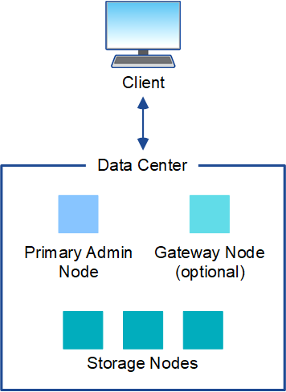

= Architettura StorageGRID e topologia di rete
:allow-uri-read: 
:icons: font
:imagesdir: ../media/

[role="lead"]
Un sistema StorageGRID è costituito da più tipi di nodi grid in uno o più siti del data center.

Per ulteriori informazioni sulla topologia della rete StorageGRID, sui requisiti e sulle comunicazioni Grid, consultare link:../network/index.html["Linee guida per il networking"].

== Topologie di implementazione

Il sistema StorageGRID può essere implementato in un singolo sito del data center o in più siti del data center.

=== Sito singolo

In un'implementazione con un singolo sito, l'infrastruttura e le operazioni del sistema StorageGRID sono centralizzate.

=== Più siti

In un'implementazione con più siti, è possibile installare diversi tipi e numeri di risorse StorageGRID in ogni sito. Ad esempio, potrebbe essere necessario più storage in un data center che in un altro.

Siti diversi sono spesso collocati in posizioni geografiche diverse in diversi domini di guasto, come ad esempio una linea di guasto sismica o una pianura alluvionale. La condivisione dei dati e il disaster recovery si ottengono attraverso la distribuzione automatica dei dati ad altri siti.

image::../media/data_center_sites_multiple.png[Più siti data center]

In un singolo data center possono inoltre esistere più siti logici per consentire l'utilizzo della replica distribuita e della codifica di cancellazione per aumentare la disponibilità e la resilienza.

=== Ridondanza del nodo di rete

In un'implementazione a sito singolo o multi-sito, è possibile includere facoltativamente più di un nodo di amministrazione o un nodo gateway per la ridondanza. Ad esempio, è possibile installare più di un nodo di amministrazione in un singolo sito o in diversi siti. Tuttavia, ogni sistema StorageGRID può disporre di un solo nodo amministratore primario.

== Architettura di sistema

Questo diagramma mostra come i nodi della griglia sono disposti all'interno di un sistema StorageGRID.

image::../media/grid_nodes_and_components.png[diagramma descritto dal testo circostante]

I client S3 e Swift memorizzano e recuperano oggetti in StorageGRID. Altri client vengono utilizzati per inviare notifiche e-mail, per accedere all'interfaccia di gestione di StorageGRID e, facoltativamente, per accedere alla condivisione dell'audit.

I client S3 e Swift possono connettersi a un nodo gateway o a un nodo amministratore per utilizzare l'interfaccia di bilanciamento del carico per i nodi di storage. In alternativa, i client S3 e Swift possono connettersi direttamente ai nodi di storage utilizzando HTTPS.

Gli oggetti possono essere memorizzati all'interno di StorageGRID su nodi di storage basati su software o hardware oppure in pool di storage cloud, costituiti da bucket S3 esterni o container di storage Blob Azure.

== Nodi e servizi Grid

Il building block di base di un sistema StorageGRID è il nodo grid. I nodi contengono servizi, ovvero moduli software che forniscono un insieme di funzionalità a un nodo grid.

Il sistema StorageGRID utilizza quattro tipi di nodi di rete:

* *I nodi di amministrazione* forniscono servizi di gestione quali configurazione, monitoraggio e registrazione del sistema. Quando si accede a Grid Manager, si sta effettuando la connessione a un nodo amministratore. Ogni grid deve avere un nodo di amministrazione primario e potrebbe avere ulteriori nodi di amministrazione non primari per la ridondanza. È possibile connettersi a qualsiasi nodo amministratore e ciascun nodo amministratore visualizza una vista simile del sistema StorageGRID. Tuttavia, le procedure di manutenzione devono essere eseguite utilizzando il nodo di amministrazione primario.
+
I nodi di amministrazione possono anche essere utilizzati per bilanciare il carico del traffico dei client S3 e Swift.

* *I nodi di storage* gestiscono e memorizzano i dati e i metadati degli oggetti. Ogni sistema StorageGRID deve avere almeno tre nodi di storage. Se si dispone di più siti, ogni sito all'interno del sistema StorageGRID deve avere anche tre nodi di storage.
* *I nodi gateway (opzionali)* forniscono un'interfaccia per il bilanciamento del carico che le applicazioni client possono utilizzare per connettersi a StorageGRID. Un bilanciamento del carico indirizza perfettamente i client a un nodo di storage ottimale, in modo che il guasto dei nodi o persino di un intero sito sia trasparente. È possibile utilizzare una combinazione di nodi gateway e nodi di amministrazione per il bilanciamento del carico oppure implementare un bilanciamento del carico HTTP di terze parti.
* *I nodi di archiviazione (deprecati)* forniscono un'interfaccia opzionale attraverso la quale i dati degli oggetti possono essere archiviati su nastro.

Per ulteriori informazioni, vedere link:../admin/index.html["Amministrare StorageGRID"].

=== Nodi basati su software

I nodi grid basati su software possono essere implementati nei seguenti modi:

* Come macchine virtuali (VM) in VMware vSphere
* All'interno di motori container su host Linux. Sono supportati i seguenti sistemi operativi:
+
** Red Hat Enterprise Linux
** CentOS
** Ubuntu
** Debian

Per ulteriori informazioni, vedere quanto segue:

* link:../vmware/index.html["Installare VMware"]
* link:../rhel/index.html["Installare Red Hat Enterprise Linux o CentOS"]
* link:../ubuntu/index.html["Installare Ubuntu o Debian"]

Utilizzare https://imt.netapp.com/matrix/#welcome["Tool di matrice di interoperabilità NetApp (IMT)"^] per ottenere un elenco delle versioni supportate.

=== Nodi appliance StorageGRID

Le appliance hardware StorageGRID sono progettate appositamente per l'utilizzo in un sistema StorageGRID. Alcune appliance possono essere utilizzate come nodi di storage. Altri appliance possono essere utilizzati come nodi di amministrazione o nodi gateway. È possibile combinare nodi appliance con nodi basati su software o implementare grid all-appliance completamente progettati che non hanno dipendenze da hypervisor esterni, storage o hardware di calcolo.

Sono disponibili i seguenti tipi di appliance StorageGRID:

* L'appliance di storage *SGF6112* è un server all-flash a 1 unità rack (1U) dotato di 12 unità SSD NVMe (nonvolatile Memory Express) con controller di calcolo e storage integrati.
* Le appliance di servizi *SG100 e SG1000* sono server a 1 unità rack (1U) che possono funzionare ciascuno come nodo di amministrazione primario, nodo di amministrazione non primario o nodo gateway. Entrambe le appliance possono operare contemporaneamente come nodi gateway e nodi di amministrazione (primari e non primari).
* L'appliance di storage *SG6000* funziona come nodo di storage e combina il controller di calcolo 1U SG6000-CN con uno shelf di controller di storage 2U o 4U. SG6000 è disponibile in due modelli:
+
** *SGF6024*: Combina il controller di calcolo SG6000-CN con uno shelf di controller di storage 2U che include 24 unità a stato solido (SSD) e controller di storage ridondanti.
** *SG6060*: Combina il controller di calcolo SG6000-CN con un enclosure 4U che include 58 unità NL-SAS, 2 SSD e controller storage ridondanti. Ogni appliance SG6060 supporta uno o due shelf di espansione da 60 dischi, fornendo fino a 178 dischi dedicati allo storage a oggetti.

* L'appliance di storage *SG5700* è una piattaforma di storage e calcolo integrata che opera come nodo di storage. SG5700 è disponibile in due modelli:
+
** *SG5712*: Enclosure 2U che include 12 unità NL-SAS e controller di calcolo e storage integrati.
** *SG5760*: Enclosure 4U che include 60 unità NL-SAS e controller di calcolo e storage integrati.

Per ulteriori informazioni, vedere quanto segue:

* https://hwu.netapp.com["NetApp Hardware Universe"^]
* link:../installconfig/hardware-description-sg6100.html["Appliance di storage SGF6112"]
* link:../installconfig/hardware-description-sg100-and-1000.html["Appliance di servizi SG100 e SG1000"]
* link:../installconfig/hardware-description-sg6000.html["Appliance di storage SG6000"]
* link:../installconfig/hardware-description-sg5700.html["Appliance di storage SG5700"]

=== Servizi primari per nodi di amministrazione

La tabella seguente mostra i servizi primari per i nodi di amministrazione; tuttavia, questa tabella non elenca tutti i servizi dei nodi.

[cols="1a,2a"]
|===
| Servizio | Funzione dei tasti 

 a| 
Sistema di gestione dell'audit (AMS)
 a| 
Tiene traccia dell'attività e degli eventi del sistema.

 a| 
Nodo di gestione della configurazione (CMN)
 a| 
Gestisce la configurazione a livello di sistema. Solo nodo amministratore primario.

 a| 
Management Application Program Interface (Mgmt-api)
 a| 
Elabora le richieste provenienti dall'API Grid Management e dall'API Tenant Management.

 a| 
Alta disponibilità
 a| 
Gestisce gli indirizzi IP virtuali ad alta disponibilità per gruppi di nodi di amministrazione e nodi gateway.

*Nota:* questo servizio si trova anche sui nodi gateway.

 a| 
Bilanciamento del carico
 a| 
Fornisce il bilanciamento del carico del traffico S3 e Swift dai client ai nodi di storage.

*Nota:* questo servizio si trova anche sui nodi gateway.

 a| 
NMS (Network Management System)
 a| 
Fornisce funzionalità per Grid Manager.

 a| 
Prometheus
 a| 
Raccoglie e memorizza le metriche delle serie temporali dai servizi su tutti i nodi.

 a| 
Server Status Monitor (SSM)
 a| 
Monitora il sistema operativo e l'hardware sottostante.

|===

=== Servizi primari per i nodi di storage

La tabella seguente mostra i servizi primari per i nodi di storage; tuttavia, questa tabella non elenca tutti i servizi del nodo.

NOTE: Alcuni servizi, come il servizio ADC e il servizio RSM, in genere esistono solo su tre nodi di storage in ogni sito.

[cols="1a,2a"]
|===
| Servizio | Funzione dei tasti 

 a| 
Account (acct)
 a| 
Gestisce gli account tenant.

 a| 
ADC (Administrative Domain Controller)
 a| 
Mantiene la topologia e la configurazione a livello di griglia.

 a| 
Cassandra
 a| 
Memorizza e protegge i metadati degli oggetti.

 a| 
Cassandra Reaper
 a| 
Esegue la riparazione automatica dei metadati degli oggetti.

 a| 
Chunk
 a| 
Gestisce i dati con codifica erasure e i frammenti di parità.

 a| 
Data Mover (dmv)
 a| 
Sposta i dati nei pool di cloud storage.

 a| 
Data store distribuito (DDS)
 a| 
Monitora lo storage dei metadati degli oggetti.

 a| 
Identità (idnt)
 a| 
Consente di federare le identità degli utenti da LDAP e Active Directory.

 a| 
Router di distribuzione locale (LDR)
 a| 
Elabora le richieste del protocollo di storage a oggetti e gestisce i dati degli oggetti su disco.

 a| 
Replicated state Machine (RSM)
 a| 
Garantisce che le richieste di servizi della piattaforma S3 vengano inviate ai rispettivi endpoint.

 a| 
Server Status Monitor (SSM)
 a| 
Monitora il sistema operativo e l'hardware sottostante.

|===

=== Servizi primari per i nodi gateway

La tabella seguente mostra i servizi primari per i nodi gateway; tuttavia, questa tabella non elenca tutti i servizi dei nodi.

[cols="1a,2a"]
|===
| Servizio | Funzione dei tasti 

 a| 
Alta disponibilità
 a| 
Gestisce gli indirizzi IP virtuali ad alta disponibilità per gruppi di nodi di amministrazione e nodi gateway.

*Nota:* questo servizio si trova anche nei nodi di amministrazione.

 a| 
Bilanciamento del carico
 a| 
Fornisce il bilanciamento del carico di livello 7 del traffico S3 e Swift dai client ai nodi di storage. Si tratta del meccanismo di bilanciamento del carico consigliato.

*Nota:* questo servizio si trova anche nei nodi di amministrazione.

 a| 
Server Status Monitor (SSM)
 a| 
Monitora il sistema operativo e l'hardware sottostante.

|===

=== Servizi primari per i nodi di archiviazione

La tabella seguente mostra i servizi primari per i nodi di archiviazione (ora deprecati); tuttavia, questa tabella non elenca tutti i servizi dei nodi.

NOTE: Il supporto per i nodi di archiviazione è obsoleto e verrà rimosso in una release futura.

[cols="1a,2a"]
|===
| Servizio | Funzione dei tasti 

 a| 
Archivio (ARC)
 a| 
Comunica con un sistema di storage su nastro esterno Tivoli Storage Manager (TSM).

 a| 
Server Status Monitor (SSM)
 a| 
Monitora il sistema operativo e l'hardware sottostante.

|===

=== Servizi StorageGRID

Di seguito viene riportato un elenco completo dei servizi StorageGRID.

* *Account Service Forwarder*
+
Fornisce un'interfaccia per il servizio Load Balancer per eseguire query sull'account Service sugli host remoti e fornisce notifiche delle modifiche della configurazione degli endpoint del bilanciamento del carico al servizio Load Balancer. Il servizio Load Balancer è presente nei nodi Admin e nei nodi Gateway.

* *Servizio ADC (Controller di dominio amministrativo)*
+
Mantiene le informazioni sulla topologia, fornisce servizi di autenticazione e risponde alle query provenienti dai servizi LDR e CMN. Il servizio ADC è presente su ciascuno dei primi tre nodi di storage installati in un sito.

* *Servizio AMS (Audit Management System)*
+
Monitora e registra tutti gli eventi e le transazioni di sistema verificati in un file di log di testo. Il servizio AMS è presente nei nodi di amministrazione.

* *Servizio ARC (Archivio)*
+
Fornisce l'interfaccia di gestione con cui configurare le connessioni allo storage di archiviazione esterno, ad esempio il cloud tramite un'interfaccia S3 o un nastro tramite il middleware TSM. Il servizio ARC è presente nei nodi di archiviazione.

* *Cassandra Reaper service*
+
Esegue la riparazione automatica dei metadati degli oggetti. Il servizio Cassandra Reaper è presente su tutti i nodi di storage.

* *Servizio Chunk*
+
Gestisce i dati con codifica erasure e i frammenti di parità. Il servizio Chunk è presente sui nodi di storage.

* *Servizio CMN (nodo di gestione della configurazione)*
+
Gestisce le configurazioni a livello di sistema e le attività di grid. Ogni griglia dispone di un servizio CMN, presente sul nodo di amministrazione primario.

* *Servizio DDS (archivio dati distribuito)*
+
Si interfaccia con il database Cassandra per gestire i metadati degli oggetti. Il servizio DDS è presente sui nodi di storage.

* *Servizio DMV (Data Mover)*
+
Sposta i dati negli endpoint cloud. Il servizio DMV è presente sui nodi di storage.

* *Servizio IP dinamico*
+
Monitora la griglia per verificare la presenza di modifiche IP dinamiche e aggiorna le configurazioni locali. Il servizio Dynamic IP (dinip) è presente su tutti i nodi.

* *Servizio Grafana*
+
Utilizzato per la visualizzazione delle metriche in Grid Manager. Il servizio Grafana è presente nei nodi di amministrazione.

* *Servizio ad alta disponibilità*
+
Gestisce gli IP virtuali ad alta disponibilità sui nodi configurati nella pagina High Availability Groups. Il servizio High Availability è presente nei nodi Admin e nei nodi Gateway. Questo servizio è anche noto come servizio keepalived.

* Servizio *identità (idnt)*
+
Consente di federare le identità degli utenti da LDAP e Active Directory. Il servizio di identità (idnt) è presente su tre nodi di storage in ogni sito.

* *Servizio arbitro Lambda*
+
Gestisce le richieste S3 Select SelectObjectContent.

* *Servizio Load Balancer*
+
Fornisce il bilanciamento del carico del traffico S3 e Swift dai client ai nodi di storage. Il servizio Load Balancer può essere configurato tramite la pagina di configurazione degli endpoint del bilanciamento del carico. Il servizio Load Balancer è presente nei nodi Admin e nei nodi Gateway. Questo servizio è noto anche come servizio nginx-gw.

* *Servizio LDR (Local Distribution Router)*
+
Gestisce lo storage e il trasferimento dei contenuti all'interno della griglia. Il servizio LDR è presente sui nodi di storage.

* *Servizio MISCd Information Service Control Daemon*
+
Fornisce un'interfaccia per eseguire query e gestire servizi su altri nodi e per gestire le configurazioni ambientali sul nodo, ad esempio per eseguire query sullo stato dei servizi in esecuzione su altri nodi. Il servizio MISCd è presente su tutti i nodi.

* *servizio nginx*
+
Agisce come meccanismo di autenticazione e comunicazione sicura per diversi servizi grid (come Prometheus e Dynamic IP) per poter comunicare con servizi su altri nodi tramite API HTTPS. Il servizio nginx è presente su tutti i nodi.

* *servizio nginx-gw*
+
Alimenta il servizio Load Balancer. Il servizio nginx-gw è presente nei nodi Admin e nei nodi Gateway.

* *Servizio NMS (Network Management System)*
+
Alimenta le opzioni di monitoraggio, reporting e configurazione visualizzate tramite Grid Manager. Il servizio NMS è presente nei nodi di amministrazione.

* *Servizio di persistenza*
+
Gestisce i file sul disco root che devono persistere durante un riavvio. Il servizio di persistenza è presente su tutti i nodi.

* *Servizio Prometheus*
+
Raccoglie le metriche delle serie temporali dai servizi su tutti i nodi. Il servizio Prometheus è presente sui nodi di amministrazione.

* *Servizio RSM (Replicated state Machine Service)*
+
Garantisce che le richieste di servizio della piattaforma vengano inviate ai rispettivi endpoint. Il servizio RSM è presente sui nodi di storage che utilizzano il servizio ADC.

* *Servizio SSM (Server Status Monitor)*
+
Monitora le condizioni dell'hardware e invia report al servizio NMS. Un'istanza del servizio SSM è presente su ogni nodo grid.

* *Servizio di raccolta tracce*
+
Esegue la raccolta di tracce per raccogliere informazioni da utilizzare per il supporto tecnico. Il servizio trace collector utilizza il software Jaeger open source ed è presente sui nodi di amministrazione.

