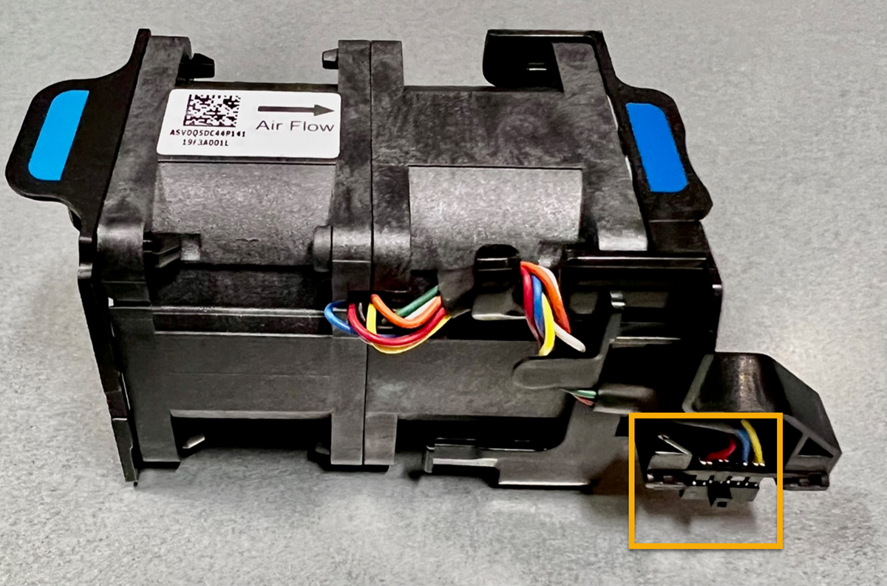

= Sostituire la ventola di un'appliance SGF6112
:allow-uri-read: 
:icons: font
:imagesdir: ../media/

[role="lead"]
L'appliance SGF6112 è dotata di otto ventole di raffreddamento. Se una delle ventole si guasta, è necessario sostituirla il prima possibile per assicurarsi che l'apparecchio sia raffreddato correttamente.

.Prima di iniziare
* Si dispone della ventola sostitutiva corretta.
* La posizione della ventola da sostituire è stata determinata.
+
link:verify-component-to-replace.html["Verificare il componente da sostituire"]

* L'appliance SGF6112 è stata fisicamente posizionata in cui si sta sostituendo la ventola nel data center.
+
link:locating-sgf6112-in-data-center.html["Individuare l'appliance nel data center"]

+

NOTE: R link:shut-down-sgf6112.html["spegnimento controllato dell'apparecchio"] è necessario prima di rimuovere l'apparecchio dal rack.

* Tutti i cavi sono stati scollegati e la copertura dell'apparecchio è stata rimossa.
+
link:reinstalling-sgf6112-cover.html["Rimuovere il coperchio SGF6112"]

* Hai confermato che le altre ventole sono installate e in esecuzione.

.A proposito di questa attività
Per evitare interruzioni del servizio, verificare che tutti gli altri nodi di storage siano collegati alla rete prima di iniziare la sostituzione della ventola o sostituire la ventola durante una finestra di manutenzione programmata, quando sono normalmente previsti periodi di interruzione del servizio. Consultare le informazioni su link:../monitor/monitoring-system-health.html#monitor-node-connection-states["monitoraggio degli stati di connessione del nodo"].

IMPORTANT: Se è stata utilizzata una regola ILM che crea una sola copia di un oggetto, è necessario sostituire la ventola durante una finestra di manutenzione pianificata. In caso contrario, è possibile che l'accesso a tali oggetti venga temporaneamente perso durante questa procedura. Vedere le informazioni su link:../ilm/why-you-should-not-use-single-copy-replication.html["perché non utilizzare la replica a copia singola"].

Il nodo dell'appliance non sarà accessibile durante la sostituzione della ventola.

La fotografia mostra una ventola per l'apparecchio. Il connettore elettrico viene evidenziato. Le ventole di raffreddamento sono accessibili dopo aver aperto il coperchio superiore dell'apparecchio.

NOTE: Ciascuna delle due unità di alimentazione contiene anche una ventola. Le ventole dell'alimentatore non sono incluse in questa procedura.

.Fasi
. Avvolgere l'estremità del braccialetto ESD intorno al polso e fissare l'estremità del fermaglio a una messa a terra metallica per evitare scariche elettrostatiche.
. Individuare la ventola da sostituire.
+
Le otto ventole si trovano nelle seguenti posizioni nello chassis (metà anteriore di SGF6112 con coperchio superiore rimosso in figura):

+
image::../media/SGF6112-fan-locations.png[Posizioni delle ventole]

|===

|  | Gruppo ventola 

 a| 
1
 a| 
Fan_SYS0

 a| 
2
 a| 
Fan_SYS1

 a| 
3
 a| 
Fan_SYS2

 a| 
4
 a| 
Fan_SYS3

 a| 
5
 a| 
Fan_SYS4

 a| 
6
 a| 
Fan_SYS5

 a| 
7
 a| 
Fan_SYS6

 a| 
8
 a| 
Fan_SYS7

|===
. Utilizzando le linguette blu sulla ventola, estrarre la ventola guasta dal telaio.
+
image::../media/fan_removal.png[Rimozione della ventola]

. Far scorrere la ventola sostitutiva nello slot aperto dello chassis.
+
Assicurarsi di allineare il connettore della ventola con la presa della scheda a circuiti stampati.

. Premere con decisione il connettore della ventola nella scheda a circuiti stampati (presa evidenziata).
+
image::../media/sgf6112_fan_socket_check.png[Controllo del connettore della ventola]

. Riposizionate il coperchio superiore sull'apparecchio e premete il dispositivo di chiusura per fissare il coperchio in posizione.
. Accendere l'apparecchio e monitorare i LED dell'apparecchio e i codici di avvio.
+
Utilizzare l'interfaccia BMC per monitorare lo stato di avvio.

. Verificare che il nodo appliance sia visualizzato in Grid Manager e che non vengano visualizzati avvisi.

Dopo aver sostituito il componente, restituire il componente guasto a NetApp, come descritto nelle istruzioni RMA fornite con il kit. Vedere https://mysupport.netapp.com/site/info/rma["Parti restituita  sostituzioni"^] per ulteriori informazioni.
